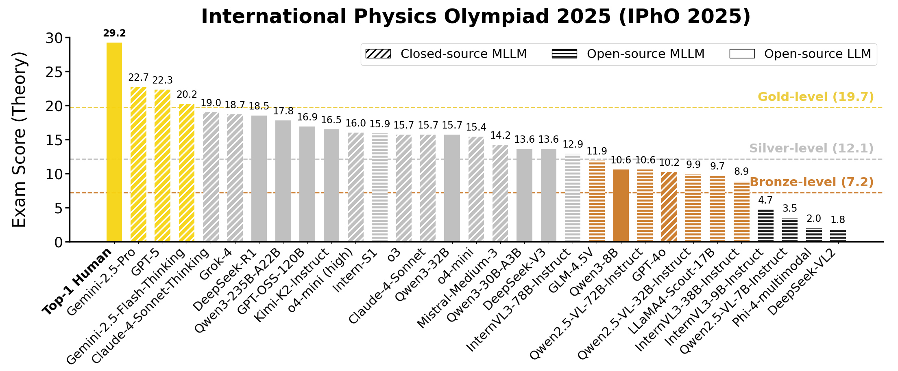
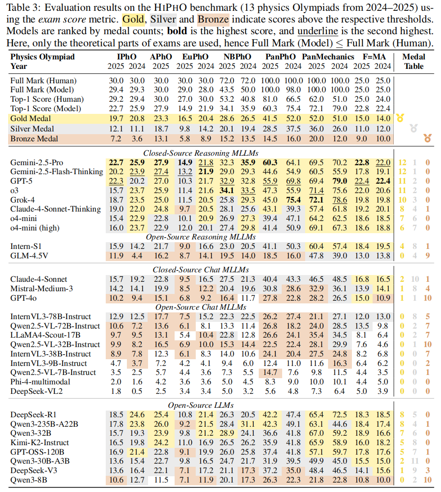

# 🥇 HiPhO: High School Physics Olympiad Benchmark

<div align="center">

<p align="center">
<a href="https://huggingface.co/datasets/SciYu/HiPhO">[🏆 Leaderboard]</a>
<a href="https://huggingface.co/datasets/SciYu/HiPhO">[📊 Dataset]</a>
<a href="https://github.com/SciYu/HiPhO">[✨ GitHub]</a>
<a href="https://huggingface.co/papers/2509.07894">[📄 Paper]</a>
</p>

[](https://opensource.org/license/mit)
</div>

<div align="center">
  
</div>

- 🏆 **New (Sep. 16):** Introducing "**PhyArena**" - our new physics reasoning leaderboard that now includes the **HiPhO leaderboard**.


## 🌐 Introduction

**HiPhO** (High School Physics Olympiad Benchmark) is the **first benchmark** specifically designed to evaluate the physical reasoning abilities of (M)LLMs on **real-world Physics Olympiads from 2024–2025**.

<div align="center">
  
</div>

### ✨ Key Features

1. **Up-to-date Coverage**: Includes 13 Olympiad exam papers from 2024–2025 across international and regional competitions.
2. **Mixed-modal Content**: Supports four modality types, spanning from text-only to diagram-based problems.
3. **Professional Evaluation**: Uses official marking schemes for answer-level and step-level grading.
4. **Human-level Comparison**: Maps model scores to medal levels (Gold/Silver/Bronze) and compares with human performance.


## 🏆 IPhO 2025 (Theory) Results

<div align="center">
  
</div>

- **Top-1 Human Score**: 29.2 / 30.0  
- **Top-1 Model Score**: 22.7 / 29.4 (Gemini-2.5-Pro)  
- **Gold Threshold**: 19.7
- **Silver Threshold**: 12.1
- **Bronze Threshold**: 7.2  

> Although models like Gemini-2.5-Pro and GPT-5 achieved gold-level scores, they still fall noticeably short of the very best human contestants.


## 📊 Dataset Overview

<div align="center">
  
</div>

HiPhO contains:
- **13 Physics Olympiads**
- **360 Problems**
- Categorized across:
  - **5 Physics Fields**: Mechanics, Electromagnetism, Thermodynamics, Optics, Modern Physics
  - **4 Modality Types**: Text-Only, Text+Illustration Figure, Text+Variable Figure, Text+Data Figure
  - **6 Answer Types**: Expression, Numerical Value, Multiple Choice, Equation, Open-Ended, Inequality

Evaluation is conducted using:  
- **Answer-level and step-level scoring**, aligned with official marking schemes  
- **Exam score** as the evaluation metric  
- **Medal-based comparison**, using official thresholds for gold, silver, and bronze  


## 🖼️ Modality Categorization

<div align="center">
  
</div>

- 📝 **Text-Only (TO)**: Pure text, no figures  
- 🎯 **Text+Illustration Figure (TI)**: Figures illustrate physical setups
- 📐 **Text+Variable Figure (TV)**: Figures define key variables or geometry
- 📊 **Text+Data Figure (TD)**: Figures show plots, data, or functions absent from text

> As models move from TO → TD, performance drops sharply—highlighting the challenges of visual reasoning.


## 📈 Main Results

<div align="center">
  
</div>

- **Closed-source reasoning MLLMs** lead the benchmark, earning **6–12 gold medals** (Top 5: Gemini-2.5-Pro, Gemini-2.5-Flash, GPT-5, o3, Grok-4)
- **Open-source MLLMs** mostly score at or below the **bronze** level 
- **Open-source LLMs** demonstrate **stronger reasoning** and generally outperform open-source MLLMs  


## 📥 Download

- Dataset & Annotations: [https://huggingface.co/datasets/SciYu/HiPhO](https://huggingface.co/datasets/SciYu/HiPhO)
- GitHub Repository: [https://github.com/SciYu/HiPhO](https://github.com/SciYu/HiPhO)
- 📄 Paper: [https://arxiv.org/abs/2509.07894](https://arxiv.org/abs/2509.07894)
- 📧 Contact: *fangchenyu@link.cuhk.edu.cn*


## 🔖 Citation

```bibtex
@article{hipho2025,
  title={HiPhO: How Far Are (M)LLMs from Humans in the Latest High School Physics Olympiad Benchmark?},
  author={Yu, Fangchen and Wan, Haiyuan and Cheng, Qianjia and Zhang, Yuchen and Chen, Jiacheng and Han, Fujun and Wu, Yulun and Yao, Junchi and Hu, Ruilizhen and Ding, Ning and Cheng, Yu and Chen, Tao and Bai, Lei and Zhou, Dongzhan and Luo, Yun and Cui, Ganqu and Ye, Peng},
  journal={arXiv preprint arXiv:2509.07894},
  year={2025}
}
```